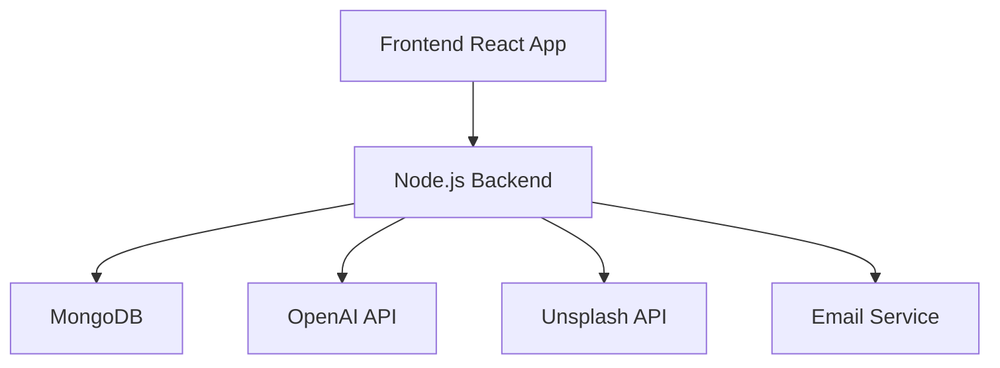

# AI Holiday Card Message Generator - Documentation

## Table of Contents

1. [Project Overview](#project-overview)
2. [Architecture](#architecture)
3. [Installation](#installation)
4. [Features & Functionality](#features--functionality)
5. [Technical Implementation](#technical-implementation)
6. [Configuration](#configuration)
7. [Deployment](#deployment)
8. [API Documentation](#api-documentation)
9. [Security](#security)
10. [Maintenance & Monitoring](#maintenance--monitoring)

## Project Overview

The AI Holiday Card Message Generator is a modern web application that leverages artificial
intelligence to create personalized holiday messages. Built with React and Node.js, it offers a
sophisticated platform for generating customized holiday greetings in multiple languages with
various styles and tones.

### Key Features

- AI-powered message generation
- Support for 10 languages
- Customizable message styles and tones
- Credit-based usage system
- Theme customization
- Background image integration via Unsplash
- Mobile-responsive design

## Architecture

### Frontend Stack

- React + Vite
- Chakra UI for components
- i18next for internationalization
- Zustand for state management
- React Query for data fetching
- PWA support

### Backend Stack

- Node.js
- MongoDB
- Docker containerization
- OpenAI API integration
- Unsplash API integration

### System Components



## Installation

### Prerequisites

- Node.js 16+
- Docker and Docker Compose
- MongoDB
- Bun runtime

### Local Development Setup

```bash
# Clone the repository
git clone [repository-url]

# Install dependencies
bun install

# Set up environment variables
cp .env.example .env

# Start development server
bun run dev

# Start backend services
docker-compose up -d
```

### Environment Variables

```
OPENAI_KEY=
GOOGLE_CLIENT_ID=
UNSPLASH_API_KEY=
ELEVEN_KEY=
JWT_SECRET=
EMAIL=
FROM_EMAIL=
EMAIL_PASSWORD=
```

## Features & Functionality

### Message Generation

- Multiple style options (Formal, Casual, Funny, Heartfelt)
- Tone selection (Warm, Professional, Playful, Sentimental)
- Personalization fields
- Real-time preview

### User Management

- Optional authentication
- Credit system
- Preference saving
- Message history

### Internationalization

- 10 supported languages
- Cultural customizations
- RTL support
- Region-specific themes

## Technical Implementation

### State Management

```javascript
// Example Zustand store structure
const useStore = create((set) => ({
    theme: 'light',
    credits: 0,
    language: 'en'
    // ... other state
}));
```

### API Integration

```javascript
// OpenAI integration example
const generateMessage = async (prompt) => {
    const response = await openai.createCompletion({
        model: 'text-davinci-003',
        prompt: prompt
        // ... configuration
    });
    return response.data.choices[0].text;
};
```

## Configuration

### Docker Configuration

```yaml
version: '3.9'
services:
    backend:
        image: extender777/holiday
        ports:
            - '8014:3000'
        environment:
            - NODE_ENV=production
            # ... other env variables
```

### Vite Configuration

```javascript
export default defineConfig({
    plugins: [
        react(),
        VitePWA({
            // PWA configuration
        })
    ]
});
```

## Deployment

### Production Deployment

1. Build the frontend:

```bash
bun run build
```

2. Deploy using Docker:

```bash
docker-compose -f docker-compose.prod.yml up -d
```

### Deployment Checklist

- [ ] Environment variables configured
- [ ] Database backup verified
- [ ] SSL certificates installed
- [ ] CDN configuration
- [ ] Monitoring setup

## API Documentation

### Endpoints

- `/api/messages/generate` - Generate new message
- `/api/users/credits` - Manage user credits
- `/api/themes` - Theme management
- `/api/images` - Background image handling

### Authentication

- JWT-based authentication
- Google OAuth integration

## Security

### Implemented Measures

- API key protection
- Rate limiting
- Input validation
- XSS protection
- CSRF protection

### Best Practices

- Regular security audits
- Dependency updates
- Access control
- Data encryption

## Maintenance & Monitoring

### Regular Tasks

- Database backups
- Log rotation
- Performance monitoring
- Error tracking

### Monitoring Tools

- Server metrics
- Application performance
- User analytics
- Error logging

## Contributing

Please refer to [CONTRIBUTING.md](CONTRIBUTING.md) for guidelines on contributing to this project.

## License

This project is licensed under the MIT License - see the [LICENSE.md](LICENSE.md) file for details.

---

For additional information or support, please contact the development team or refer to the project's
issue tracker.
